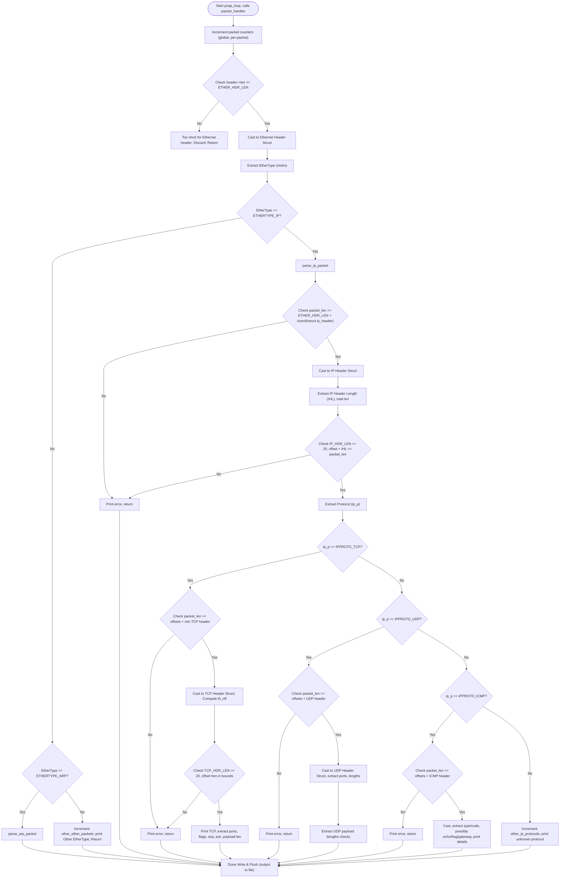

# Packet Sniffer

A lightweight packet sniffer written in **C using libpcap** that captures, analyzes, and prints details of Ethernet, IP, TCP, UDP, ARP, and ICMP packets. The project provides insights into how data flows across the network by parsing protocol headers and displaying field-level details.

---

## 🚀 Features
- Captures **Ethernet, IP, TCP, UDP, ARP, and ICMP** packets.
- Parses headers and extracts all important fields.
- Provides human-readable explanations for each field.
- Flowchart for code execution to understand packet parsing logic.
- Structured packet dissection for learning and debugging.

---

## 📦 Requirements
- Linux (Ubuntu recommended)
- gcc (C compiler)
- libpcap library

Install dependencies:
```bash
sudo apt-get update
sudo apt-get install gcc libpcap-dev -y
````

---

## ⚡ Compilation & Usage

Compile:

```bash
gcc sniffer.c -lpcap -o sniffer
```

Run with **sudo** (required for raw packet capture):

```bash
sudo ./sniffer
```

---

## 📐 Packet Structure

```
+-------------------+----------------+----------------+----------------+------------------+
| Ethernet Header   | IP Header      | TCP/UDP Header | (Optional)     | Application Data |
| (Layer 2)         | (Layer 3)      | (Layer 4)      | Payload Data   | (Layer 7 Payload)|
+-------------------+----------------+----------------+----------------+------------------+
|<---- 14 bytes --->|<- 20-60 bytes->|<- 20-24 bytes->|<-- Varies ---->|<---- Varies ---->|
```

---

## 🔹 Ethernet Header

```
+-----------------------------------+--------------------------------+---------------------+
| Destination MAC Address (6 bytes) | Source MAC Address (6 bytes)   | EtherType (2 bytes) |
+-----------------------------------+--------------------------------+---------------------+
```

* **Destination MAC** – Physical address of the recipient device.
* **Source MAC** – Physical address of the sender.
* **EtherType** – Protocol encapsulated in payload:

  * `0x0800` → IPv4
  * `0x0806` → ARP
  * `0x86DD` → IPv6

---

## 🔹 IP Header

```
        0               1               2               3
0 1 2 3 4 5 6 7 8 9 0 1 2 3 4 5 6 7 8 9 0 1 2 3 4 5 6 7 8 9 0 1 2
+-+-+-+-+-+-+-+-+-+-+-+-+-+-+-+-+-+-+-+-+-+-+-+-+-+-+-+-+-+-+-+-+
|Version|  IHL  |Type of Service|          Total Length         |
+-+-+-+-+-+-+-+-+-+-+-+-+-+-+-+-+-+-+-+-+-+-+-+-+-+-+-+-+-+-+-+-+
|         Identification        |Flags|      Fragment Offset    |
+-+-+-+-+-+-+-+-+-+-+-+-+-+-+-+-+-+-+-+-+-+-+-+-+-+-+-+-+-+-+-+-+
|  Time to Live |    Protocol   |         Header Checksum       |
+-+-+-+-+-+-+-+-+-+-+-+-+-+-+-+-+-+-+-+-+-+-+-+-+-+-+-+-+-+-+-+-+
|                        Source IP Address                      |
+-+-+-+-+-+-+-+-+-+-+-+-+-+-+-+-+-+-+-+-+-+-+-+-+-+-+-+-+-+-+-+-+
|                      Destination IP Address                   |
+-+-+-+-+-+-+-+-+-+-+-+-+-+-+-+-+-+-+-+-+-+-+-+-+-+-+-+-+-+-+-+-+
|                    Options + Padding (if any)                 |
+-+-+-+-+-+-+-+-+-+-+-+-+-+-+-+-+-+-+-+-+-+-+-+-+-+-+-+-+-+-+-+-+
```

* **Version** – IPv4 (4) or IPv6 (6).
* **IHL (Header Length)** – Number of 32-bit words in the header.
* **Type of Service (TOS/DSCP)** – Defines service priority.
* **Total Length** – Entire IP packet size (header + data).
* **Identification** – Unique packet ID for fragmentation.
* **Flags** – Fragmentation control (DF, MF).
* **Fragment Offset** – Position of fragment in original datagram.
* **Time to Live (TTL)** – Max hops allowed.
* **Protocol** – Upper layer protocol:

  * `6` → TCP
  * `17` → UDP
  * `1` → ICMP
* **Header Checksum** – Error checking.
* **Source/Destination IP Address** – Sender/Receiver IP.
* **Options** – Optional, for security/routing.

---

## 🔹 TCP Header

```
        0               1               2               3
0 1 2 3 4 5 6 7 8 9 0 1 2 3 4 5 6 7 8 9 0 1 2 3 4 5 6 7 8 9 0 1 2
+-+-+-+-+-+-+-+-+-+-+-+-+-+-+-+-+-+-+-+-+-+-+-+-+-+-+-+-+-+-+-+-+
|          Source Port          |       Destination Port        |
+-+-+-+-+-+-+-+-+-+-+-+-+-+-+-+-+-+-+-+-+-+-+-+-+-+-+-+-+-+-+-+-+
|                        Sequence Number                        |
+-+-+-+-+-+-+-+-+-+-+-+-+-+-+-+-+-+-+-+-+-+-+-+-+-+-+-+-+-+-+-+-+
|                     Acknowledgment Number                     |
+-+-+-+-+-+-+-+-+-+-+-+-+-+-+-+-+-+-+-+-+-+-+-+-+-+-+-+-+-+-+-+-+
| Header Len |Resv| Flags |             Window Size             |
+-+-+-+-+-+-+-+-+-+-+-+-+-+-+-+-+-+-+-+-+-+-+-+-+-+-+-+-+-+-+-+-+
|         Checksum              |       Urgent Pointer          |
+-+-+-+-+-+-+-+-+-+-+-+-+-+-+-+-+-+-+-+-+-+-+-+-+-+-+-+-+-+-+-+-+
|                    Options (if Data Offset > 5)               |
+-+-+-+-+-+-+-+-+-+-+-+-+-+-+-+-+-+-+-+-+-+-+-+-+-+-+-+-+-+-+-+-+
```

* **Source Port** – Sender’s port.
* **Destination Port** – Receiver’s port.
* **Sequence Number** – Byte ordering in stream.
* **Acknowledgment Number** – Confirms receipt of data.
* **Header Length** – TCP header size.
* **Flags:**

  * **URG**: Urgent pointer valid
  * **ACK**: Acknowledgment valid
  * **PSH**: Push data immediately
  * **RST**: Reset connection
  * **SYN**: Synchronize sequence numbers
  * **FIN**: Terminate connection
* **Window Size** – Flow control.
* **Checksum** – Error detection.
* **Urgent Pointer** – Data priority indicator.
* **Options** – Extra features (e.g., MSS).

---

## 🔹 UDP Header

```
0 1 2 3 4 5 6 7 8 9 0 1 2 3 4 5 6 7 8 9 0 1 2 3 4 5 6 7 8 9 0 1 2
+-+-+-+-+-+-+-+-+-+-+-+-+-+-+-+-+-+-+-+-+-+-+-+-+-+-+-+-+-+-+-+-+
|         Source Port           |          Dest Port            |
+-+-+-+-+-+-+-+-+-+-+-+-+-+-+-+-+-+-+-+-+-+-+-+-+-+-+-+-+-+-+-+-+
|           Length              |           Checksum            |
+-+-+-+-+-+-+-+-+-+-+-+-+-+-+-+-+-+-+-+-+-+-+-+-+-+-+-+-+-+-+-+-+
```

* **Source Port** – Sender’s port.
* **Destination Port** – Receiver’s port.
* **Length** – UDP header + data length.
* **Checksum** – Error detection.

---

## 🔹 ARP Header

```
        0               1               2               3
0 1 2 3 4 5 6 7 8 9 0 1 2 3 4 5 6 7 8 9 0 1 2 3 4 5 6 7 8 9 0 1 2
+-+-+-+-+-+-+-+-+-+-+-+-+-+-+-+-+-+-+-+-+-+-+-+-+-+-+-+-+-+-+-+-+
|       Hardware Type           |       Protocol Type           |
+-+-+-+-+-+-+-+-+-+-+-+-+-+-+-+-+-+-+-+-+-+-+-+-+-+-+-+-+-+-+-+-+
| Hardware Len  | Protocol Len  |         Operation             |
+-+-+-+-+-+-+-+-+-+-+-+-+-+-+-+-+-+-+-+-+-+-+-+-+-+-+-+-+-+-+-+-+
|                  Sender Hardware Address (MAC)                |
|                                                               |
+-+-+-+-+-+-+-+-+-+-+-+-+-+-+-+-+-+-+-+-+-+-+-+-+-+-+-+-+-+-+-+-+
|                  Sender IP Address (4 bytes)                  |
+-+-+-+-+-+-+-+-+-+-+-+-+-+-+-+-+-+-+-+-+-+-+-+-+-+-+-+-+-+-+-+-+
|                  Target Hardware Address (MAC)                |
|                                                               |
+-+-+-+-+-+-+-+-+-+-+-+-+-+-+-+-+-+-+-+-+-+-+-+-+-+-+-+-+-+-+-+-+
|                   Target IP Address (4 bytes)                 |
+-+-+-+-+-+-+-+-+-+-+-+-+-+-+-+-+-+-+-+-+-+-+-+-+-+-+-+-+-+-+-+-+
```

* **Hardware Type** – Network type (1 = Ethernet).
* **Protocol Type** – Protocol used (IPv4 = `0x0800`).
* **Hardware Length** – Length of MAC address (6).
* **Protocol Length** – Length of IP address (4).
* **Operation** – Request (1) or Reply (2).
* **Sender Hardware Address** – Sender’s MAC.
* **Sender IP Address** – Sender’s IP.
* **Target Hardware Address** – Receiver’s MAC.
* **Target IP Address** – Receiver’s IP.

---

## 🔹 ICMP Header

```
        0               1               2               3
0 1 2 3 4 5 6 7 8 9 0 1 2 3 4 5 6 7 8 9 0 1 2 3 4 5 6 7 8 9 0 1 2
+-+-+-+-+-+-+-+-+-+-+-+-+-+-+-+-+-+-+-+-+-+-+-+-+-+-+-+-+-+-+-+-+
|     Type      |     Code      |          Checksum             |
+-+-+-+-+-+-+-+-+-+-+-+-+-+-+-+-+-+-+-+-+-+-+-+-+-+-+-+-+-+-+-+-+
|                             Rest of Header                    |
+-+-+-+-+-+-+-+-+-+-+-+-+-+-+-+-+-+-+-+-+-+-+-+-+-+-+-+-+-+-+-+-+
```

* **Type** – ICMP message type (e.g., 0 = Echo Reply, 8 = Echo Request).
* **Code** – Further info about Type.
* **Checksum** – Error detection.
* **Rest of Header** – Depends on Type/Code (e.g., for Echo: Identifier & Sequence Number).

---

## 🔄 Code Execution Flow (Mermaid)



---

## 📚 References

* [RFC 791 – IP Protocol](https://www.rfc-editor.org/rfc/rfc791)
* [RFC 793 – TCP Protocol](https://www.rfc-editor.org/rfc/rfc793)
* [RFC 768 – UDP Protocol](https://www.rfc-editor.org/rfc/rfc768)
* [RFC 826 – ARP Protocol](https://www.rfc-editor.org/rfc/rfc826)
* [RFC 792 – ICMP Protocol](https://www.rfc-editor.org/rfc/rfc792)

---

## 🛡️ Disclaimer

This tool is for **educational purposes only**. Unauthorized packet sniffing on networks you do not own or have explicit permission to monitor may violate laws.

---

